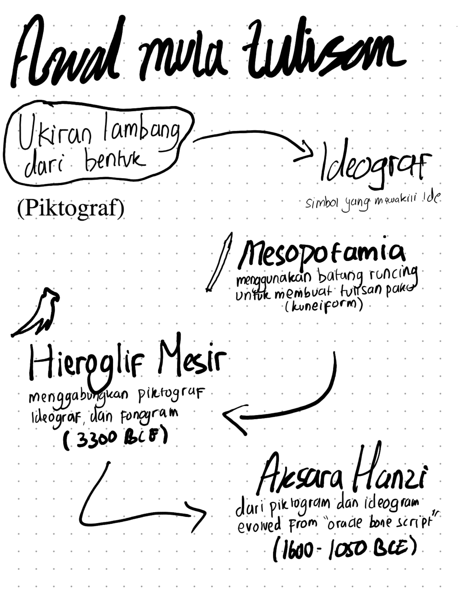
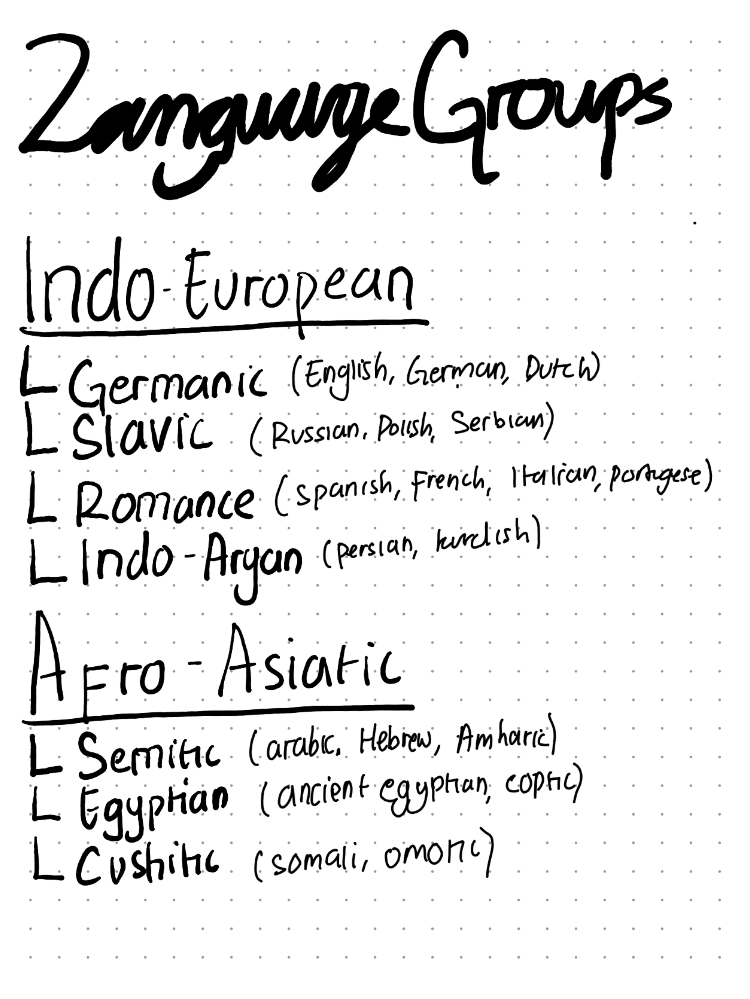
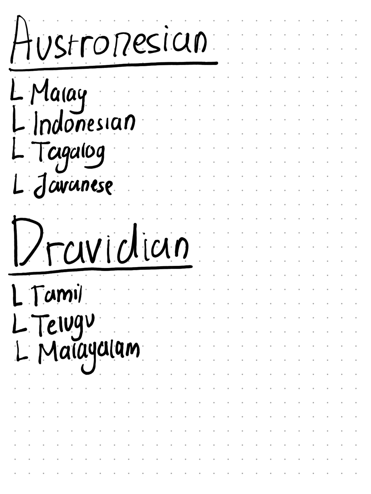
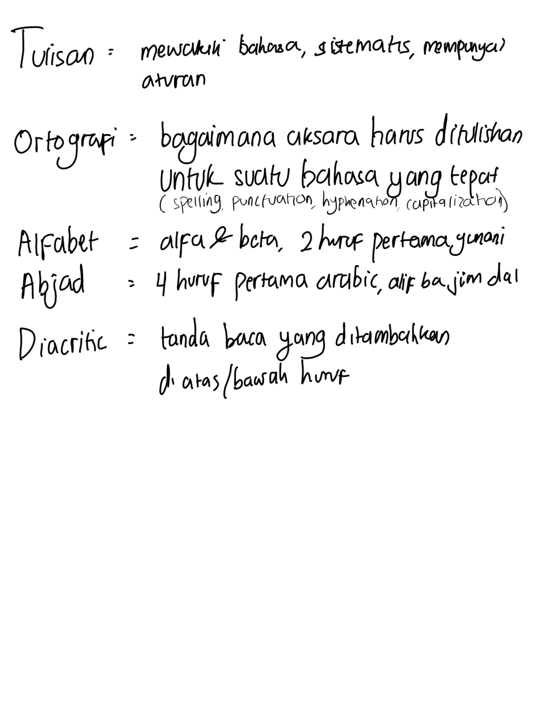

Sebelum tulisan seperti sekarang ada, dulu orang-orang mengekspresikan idenya menggunakan piktograf---menggambarkan sesuatu sesuai dengan bentuk objeknya. Berawal dari Sumeria yang berada di bagian selatan dari Mesopotamia itu piktografi ditemukan. Diukir di atas tanah liat.

Konsep tulisan ini melebar ke Mesir kuno. Mereka mempunyai konsep tulisan yang disebut hieroglyph, metode piktograf juga. Setelah itu, orang Sumeria mengadopsi phonographic system, yang mana menjadikan tulisan sebagai representasi suara. Ini cikal bakal terbuatnya alfabet dan writing system lainnya. 

Alphabet yang sekarang eksis itu berawal dari semitic alphabet. Semitic script itu adaptasi dari hieroglyph mesir, ditulis dari kanan ke kiri. Semitic script diadaptasi menjadi Greek language. Orang romawi meminjam alfabet yunani untuk membentuk huruf2 Roman atau latin.

Bahasa beradaptasi, sehingga menciptakan language group lainnya. Orang-orang bermigrasi, sehingga banyak bahasa yang mirip dengan bahasa lainnya.

## Kosakata

