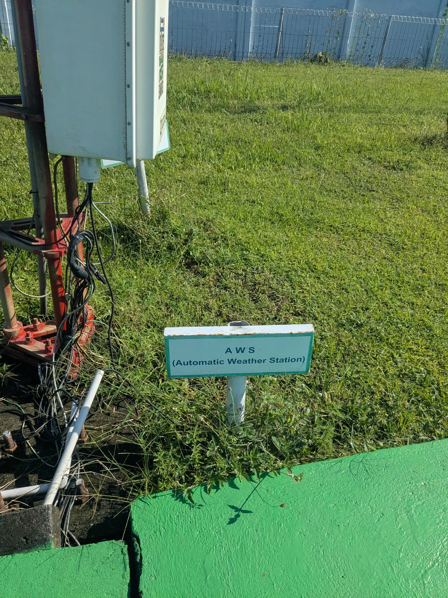
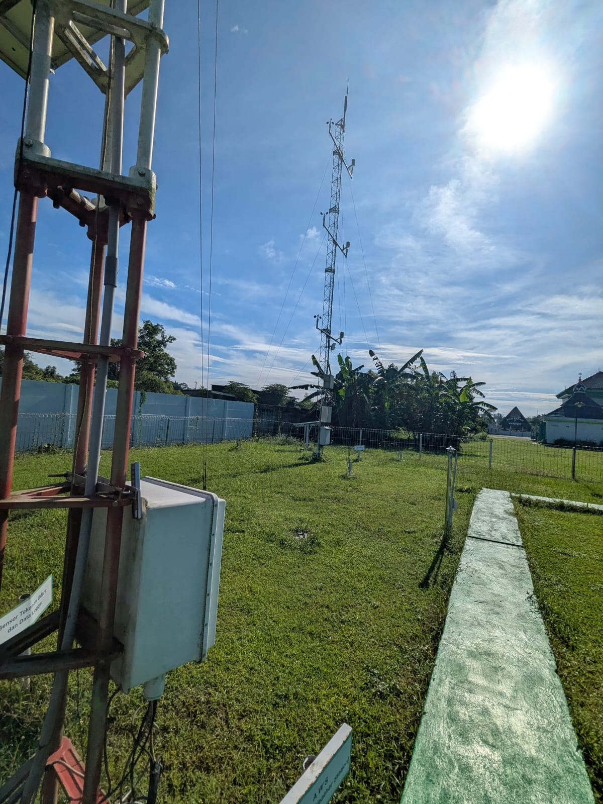

Selama ini, aku hanya tahu bahwa AWS merujuk pada sebuah service besar milik Amazon, Amazon Web Service.

Hari ini aku memulai magangku di BMKG Stasiun Klimatologi Yogyakarta. Magang hari pertama diawali dengan "orientasi ruang" bersama Mas Ardhi. Aku pun dikenalkan dengan berbagai sensor yang dimiliki oleh Stasiun Klimatologi Yogyakarta. Sampailah ke dalam alat yang bernama AWS.

Aku belajar bahwa ada sebuah alat bernama AWS, Automatic Weather Station. Sebuah seperangkat sistem terintegrasi yang terdiri dari sensor-sensor sebagai alat collect data dan auto-logger. AWS ini lah yang menjadi salah satu sumber data real-time yang dimanfaatkan oleh BMKG di Indonesia.

Data yang di-collect oleh AWS ini di antaranya Volume Curah Hujan, Suhu, Kelembaban Angin, Tekanan Udara, bahkan Paparan Radiasi Matahari. Di hari pertamaku juga, aku mendapat tugas mengolah dan memodelkan machine learning dari data hasil AWS ini.

Wish me luck

