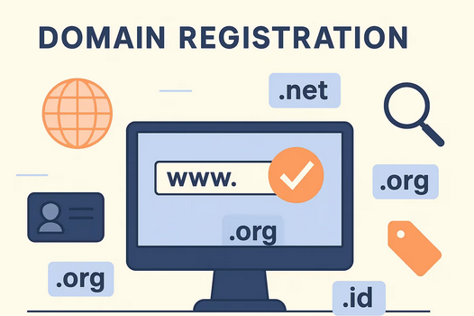

Nowadays, domains are the heart of a brand (read: personal branding). Domain take a responsibilites for an web addresses on internet can easily remembered instead of using ip address.

Structure of domain can divided into three, there is TLD, SLD, and SubDomain. TLD (Top Level Domain) is "domain" itself. TLD formed from some words or one word, for example '.com', '.online', and '.ai'. SLD (Second Level Domain) is a unique name that developer choose to paired in front of TLD, like google on google.com. How about SubDomain? Subdomain are any words in front of the SLD, for example "ask" in "ask.pradanayahya.com".

There are so much kind of TLD domains with various price range even the same TLD, in different platform. So, why this can happen?

So, every single domain is held by **registry**. Registry is a party ultimate authority over a domain extension. They set a base price for every domain extension, like .com, .id, or anything. This domain price is stable, but sometimes can be revised based on global market or their business.

After that, domains can be use on internet, but who did resell it?

Registry is the "owner" of a domain but they cannot sell it directly to user (they handle database management). So they need "sales" that can resell their domains.

We call this reseller as **registrar**. Registrar is like they wholesale from registry, then resell it to user with additional services, like security, email, server, hosting, etc. In this part, domain that have base price will increase based on the registrar. Every registrar kan mark up the price depends on their services, or any factors like business. But normally they have similiar price for a same domain.

Some domain also have crazy price because of its uniqueness and demands. For example, domain .ai is very hype now because of the hype of Artificial Intelligent.

There is why domain are so pricey. 

By the way, i have just bought .com domain from Spaceship. IT JUST $2.7 WITH **COMPROS** COUPON.

So, I have plan to move from pradanayahya.me to pradanayahya.com because of the crazy of .me renew price.