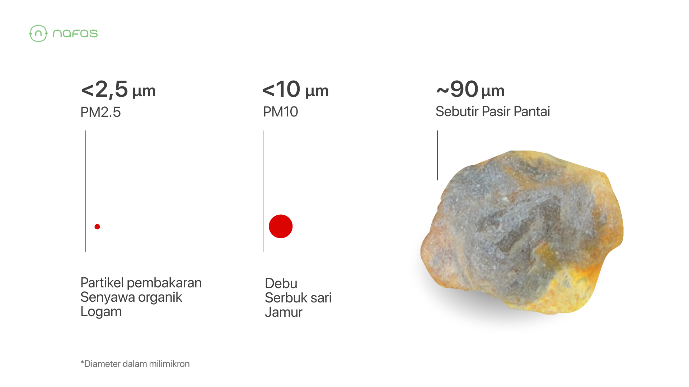
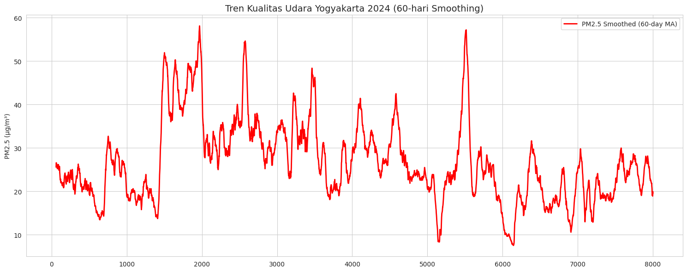

PM2.5 atau Particulate Matter dengan ukuran di bawah 2.5 mikrometer (mikron) adalah sebuah partikel halus yang memiliki diameter sangat kecil. Dalam konteks kualitas udara, PM2.5 menjadi salah satu parameter penting dalam pengukuran standar kualitas udara, seperti ISPU (Indeks Standar Pencemaran Udara) atau IQU (Index of Air Quality). 

Bayangkan, ukuran dari partikel ini 30 kali lebih kecil jika dibandingkan dengan satu helai rambut manusia. Sehingga, indeks PM2.5 adalah salah satu indeks pencemaran udara yang patut untuk diwaspadai dan dipantau. Beberapa partikel dan polutan yang masuk dalam range PM2.5 adalah partikel pembakaran, carbon, dan timbal. Beberapa sumber juga menyebutkan silika, aluminium, dan debu dengan ukuran sangat kecil termasuk dalam range PM2.5 juga.

Hal ini menunjukkan bahwa PM2.5 menjadi salah satu sumber penyakit pernapasan, seperti ISPA, ASMA, penyakit jantung, dan berbagai kondisi penyakit lain.

Standar PM2.5 WHO yang diperbarui (2021) sangat ketat di mana rata-rata tahunan tidak boleh melebihi 5 µg/m³, sementara rata-rata 24 jam tidak boleh lebih dari 15 µg/m³.

> faktanya, data kadar PM2.5 di Kabupaten Sleman mencapai rata-rata hingga 20-30 µg/m³ per hari-nya, dengan keadaan tertinggi mencapai 40-50 µg/m³ di kondisi tertentu.