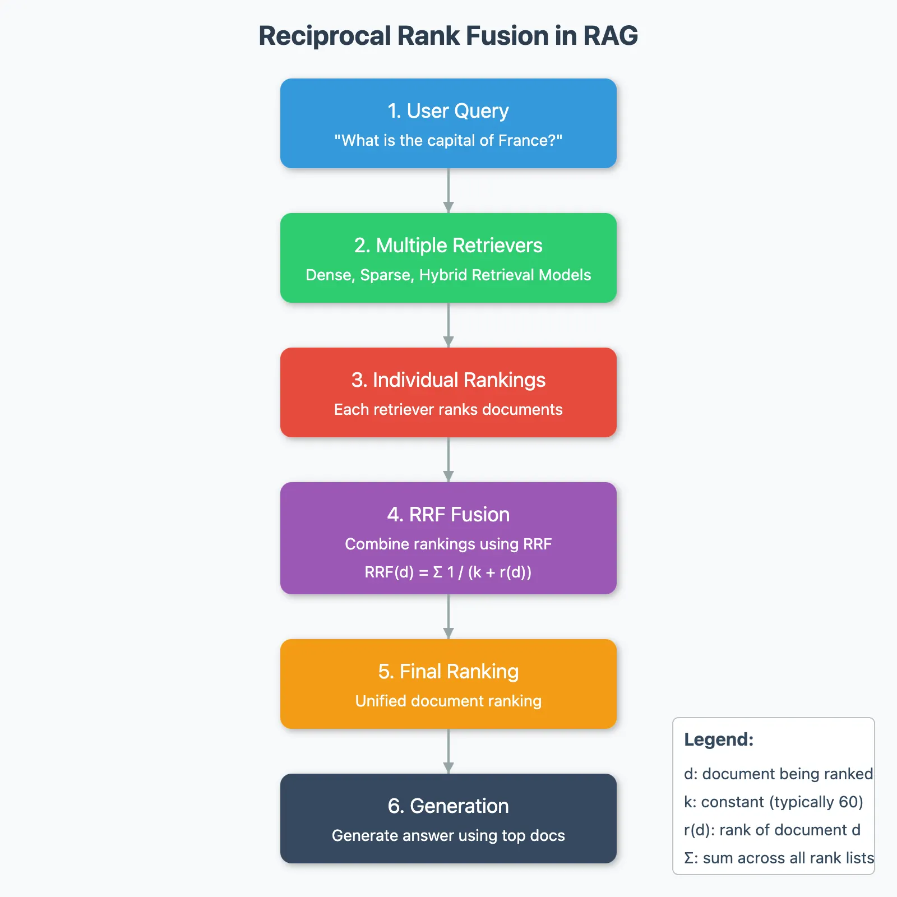

Bagaimana hybrid search dapat meningkatkan hasil pencarian query user dalam Retrieval-Augmented Generation? Reciprocal Rank Fusion (RFF) adalah salah satu jawaban terkuat saat ini.

Hari ini aku belajar bahwa hasil dense vector dan sparse vector pada hybrid search RAG tidak langsung merata-rata rank atau confidence dari masing-masing retrievers tersebut. RRF yang membuat semuanya terasa adil dan beneran "Hybrid".

Setiap hasil dari retrievers memiliki rankingnya sendiri-sendiri. Namun, penggunaan ranking tersebut tidak serta-merta di-mean. Oleh karena itu pemerataan retrievers tersebut dilakukan dengan Reciprocal Rank Fusion. RRF menggabungkan beberapa ranking (dari retrievers) tanpa peduli skor aslinya.

1. Setiap retrieval memiliki rank
2. Kombinasikan rank dengan RRF
3. Ranking terbaik dari kombinasi RRF

Bagaimana RRF meningkatkan hasil query berdasarkan ranking?

RRF melakukan operasi "flip" pada perhitungan ranking dengan tambahan konstanta = 60. Nilai 60 ini membuat ranking 1 dan bawahnya memiliki bobot yang kompetitif. Dengan kata lain, 60 ini sebagai "smooting tool".

Bayangkan, gap antara 1/1 ke 1/3 dengan 1/61 dan 1/63. Nilai ini memberi dampak yang lebih kompetitif dan adil pada setiap rank.

Tapi, kenapa harus 60? Menurut paper aslinya:
> where k = 60 was fixed during a pilot investigation and not altered during subsequent validation.
> 
> — Cormack et al., RRF Paper