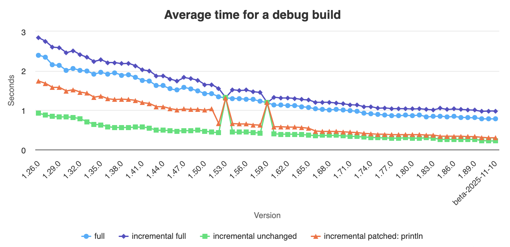

Meskipun Rust digadang-gadang sebagai bahasa pemrograman yang blazing fast di runtime, ada cost yang harus dibayarkan, yaitu build time yang lama. Kenapa tradeoff ini bisa terjadi? 

Ada [data](https://perf.rust-lang.org/dashboard.html) yang menunjukkan benchmark rustc build rust dari versi ke versi. Semakin baru versinya, semakin cepat kecepatan compilenya. Iya harus dong, kalo naik versi tapi malah makin lemot itu namanya kemunduran.



Ada satu line yang gw suka dari artikel [Rust is a disappointment](https://bykozy.me/blog/rust-is-a-disappointment/): *Rust sacrificed sanity and practicality for memory safety*. Kita sampai mengorbankan kewarasan untuk memulai ngoding Rust. Borrow checker dan lifetime dapat membuat seorang pemula menjadi gila karena merasa *di bahasa lain hal ini bisa dilakukan sementara di Rust tidak*.

Rust punya design principles yang menjadi kekuatan Rust yang menjadikannya bahasa paling dikagumi lima tahun terakhir dalam [Stackoverflow Survey](https://survey.stackoverflow.co/2025/technology#admired-and-desired):

1. Memory safety without garbage collection

Rust itu memory safe. Artinya, tidak akan ada kesalahan dalam mengakses dan memanipulasi memori saat runtime yang tidak diinginkan. Rust memaksa kita untuk membuat software yang reliable dan predictable. Kita tau kapan memory itu akan digunakan dan kapan akan di*free*.

Dengan memory safety, program akan terbebas dari masalah umum seperti data racing, null pointer exception (terutama di jawa).

Di bahasa dengan garbage collector, ada overhead dimana GCnya perlu ngecollect memory yang sudah tidak digunakan. Ini memberikan celah untuk kelalaian developer yang membuat memorinya gak jadi dicollect karena ternyata ada variabel yang secara sembunyi-sembunyi masih dipakai padahal gak guna.

2. Concurrency without data race

Meski punya fitur ownership dan borrowing, Rust tetep punya concurrency kok, malah bagus. Data di rust by default cuma bisa dimiliki oleh satu variabel (ownership). Tapi, kita juga bisa "borrow" variable tersebut, tapi pemiliknya tetep satu. Kalo kita ngeborrow dan kita mau mutate isi datanya, bisa pake tipe data `&mut`. Tapi, cuma boleh satu mutable borrow aja. 

```rs
let x = 1;
let y = &mut x; // mutable borrow, OK
let z = &mut x; // mutable borrow, NOT OK, karena gabisa borrow mutable dua kali
let aa = &x; // immutable borrow, NOT OK, karena gabisa immutable borrow kalo udah pernah mutable borrow.
```

Karena yang boleh ngelakuin mutable borrow itu cuma satu, jadi ga bakal ada data race. Kita bisa pake Arc dan Mutex untuk menjamin data consistency. Mutex itu buat ngelock data sehingga dapat diconsume dan dimutate oleh satu thread aja dalam satu waktu.

3. Zero-cost abstraction

Lu cuma pake apa yang lu pake. Misal iterator yang pipe functionnya panjang lebar tapi ga lu collect, itu ga akan alokasi extra memory.


4. Developer experience

`cargo build` is everything bro. Tapi kekurangannya kecepatan compilenya buat crate yang makin besar ya makin lemot. Penjaga build sangat ketat sampe-sampe programmatical issue itu dihadang pada build step. Penjelasan errornya crystal clear, selalu diingatkan bahwa kita tidak bisa melakukan borrow di suatu tempat, harus mendeklarasikan lifetime ketika masa hidup variabelnya ambigu. Rust-analyzer emang gacor tapi mayan lemot juga kalo cratenya udah besar.
5. Interoperability

Menghubungkan Rust dengan bahasa lainnya itu gampang banget bos. Rust ke C++ bisa pake FFI. Tapi masalahnya ya kalo di bahasa tersebut ada masalah (kayak segfault or anything) itu kita berpotensi bakal ikut kena masalah juga. Mau paku Python di Rust (atau sebaliknya) tinggal pake `pyo3`, mau pake JS function buat WASM bisa pake `js_sys`, mau pake function C++ tinggal pake `rust-bindgen`

Pengguna Rust alhamdulillah terhindar dari segmentation faults, kecuali kalo emang pake `unsafe` atau pake *foreign function interface* (FFI).

### Sayangnya, menggunakan bahasa se-safe Rust pun tidak otomatis menghilangkan ketololan penggunanya

Mari kita kembali ke kasus yang akhir-akhir ini terjadi---[cloudflare outage](../cloudflare-incident/). Masalahnya bukan di Rustnya, kalaupun ada bahasa yang paling perfect untuk digunakan provider CDN sebesar cloudflare, Rust udah paling bener. Masalahnya itu ada di devnya, kenapa pake `.unwrap()` di tengah runtime.