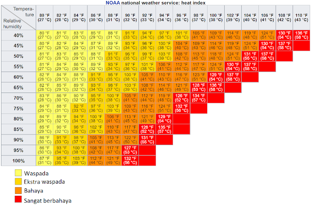

THI atau Temperature Humidity Index menjadi salah satu parameter dalam mengukur kenyamanan termal pada manusia dan hewan di lingkungan terbuka. THI dihitung berdasarkan indeks gabungan suhu dan kelembaban relatif udara.

Sebenarnya setiap negara memiliki rumus atau cara perhitungan yang berbeda, terutama daerah subtropis dengan daerah tropis.

Hari ini sudah belajar dua metode, di antaranya metode perhitungan Heat Index versi NWS (National Weather Service) dari Pemerintah Amerika Serikat dan perhitungan versi tropis dengan persamaan **Nieuwolt** yang cocok dengan Indonesia. 

Kedua rumus tersebut sama-sama menggunakan temperatur (suhu) dan kelembaban. Namun, pada rumus versi NWS Pemerintah AS menggunakan perhitungan konstanta yang sudah didefinisikan sebelumnya. Sedangkan rumus persamaan Niewolt juga menggunakan konstanta namun lebih jelas dan lebih cocok untuk iklim di Indonesia.

> THI = 0.8 T +{ (RHxT)/500} 

di mana:
- THI = Temperature Humidity Index 
- T = Suhu udara (⁰C) 
- RH = Kelembapan Relatif (%) 

Klasifikasi rasa nyaman berdasarkan suhu dan kelembapan yang dirumuskan oleh Nieuwolt sebagai berikut: 
- THI <29 ⁰C -> nyaman;
- THI = 29- 30,5 ⁰C -> tidak nyaman; 
- THI > 30,5 ⁰C -> sangat tidak nyaman;

Hari ini saya juga membuat web simpel untuk mempermudah kalkulasi index kenyamanan termal berdasarkan THI dengan rumus yang sesuai dengan dua metode sebagai project magang kedua saya di Stasiun Klimatologi DI Yogyakarta.

Kunjungi: [BMKG THI Calculator](https://bmkg-thi.pradanayahya.com "THI Calculation Tool of BMKG")